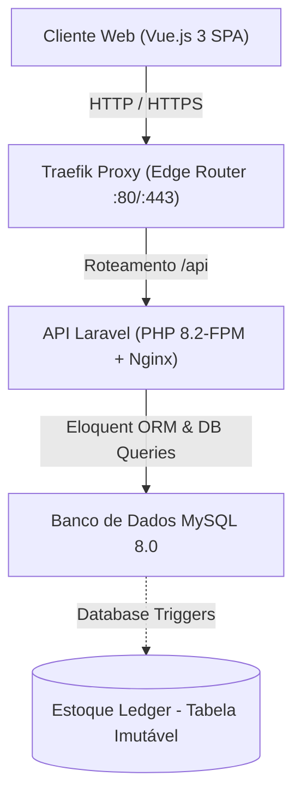

# 🏛️ Arquitetura e Design de Software — Backend

O **ProGest Backend API** segue uma arquitetura orientada a serviços monolíticos modulares (Modular Monolith) empacotada em containers Docker, assegurando alta confiabilidade, isolamento de dados hospitalares e rastreabilidade estrita.

---

## 📐 Visão Geral da Arquitetura



### Componentes de Infraestrutura:
1. **Traefik Proxy (Edge Router):**
   - Escuta as portas `80` (HTTP) e `443` (HTTPS) no host.
   - Detecta dinamicamente os containers através de *labels* Docker conectadas à rede externa `traefik-public`.
   - Faz o roteamento transparente de requisições com prefixo `/api` e `/sanctum` para o container da API.
2. **Container `progest-api`:**
   - Imagem customizada baseada em `php:8.2-fpm` com Nginx interno gerenciado via `supervisord`.
   - Contém extensões essenciais: `pdo_mysql`, `gd`, `zip`, `bcmath`, `opcache`.
3. **Container `mysql`:**
   - Imagem oficial `mysql:8.0`.
   - Executa com a diretiva `--log-bin-trust-function-creators=1` para viabilizar a criação de Triggers de auditoria sem exigência de privilégios de superusuário externo.

---

## 🧩 Camadas da Aplicação Laravel

```
app/
├── Http/
│   ├── Controllers/
│   │   ├── AuthController.php            # Sessão, login e registro
│   │   ├── UserController.php            # Gestão de usuários
│   │   ├── EstoqueController.php         # Gestão de saldo e limites
│   │   ├── EstoqueLoteController.php     # Gestão física de lotes
│   │   ├── EntradaController.php         # Notas fiscais na CAF
│   │   ├── MovimentacaoController.php    # Pedidos, FIFO e dispensações
│   │   ├── RelatoriosController.php      # Relatórios operacionais e regulatórios
│   │   ├── UsuarioSetorController.php    # Matriz de vínculos setoriais
│   │   └── Cadastros/                    # Controllers de entidades mestras
│   └── Middleware/
│       └── Authenticate.php              # Proteção via auth:sanctum
├── Models/                               # Eloquent Models com relacionamentos
│   ├── User.php
│   ├── Setores.php
│   ├── Polo.php
│   ├── Produto.php
│   ├── Estoque.php
│   ├── EstoqueLote.php
│   ├── Entrada.php
│   ├── ItensEntrada.php
│   ├── Movimentacao.php
│   ├── ItemMovimentacao.php
│   └── Devolucao.php
```

---

## 🔒 Mecanismos de Integridade e Triggers

Para evitar inconsistências físicas e contábeis de estoque, o backend implementa um modelo híbrido de validação:

### 1. Invariante de Estoque
O sistema assegura a igualdade fundamental em cada setor hospitalar com estoque:
$$\text{estoque.quantidade\_atual} = \sum \text{estoque\_lotes.quantidade\_disponivel}$$

### 2. Triggers de Auditoria e Ledger (`estoque_ledger`)
Cada movimentação no estoque gera um registro contábil imutável, permitindo reconstruir a linha do tempo de qualquer medicamento ou material.
* **Trigger em `itens_entrada`:** Atualiza o saldo consolidado de `estoque` e cria lotes em `estoque_lotes`.
* **Trigger em `item_movimentacao`:** Ao aprovar uma movimentação, debita os lotes de origem e credita no destino (para setores com estoque), gravando o tipo de transação no ledger.
* **Trigger em `devolucoes`:** Estorna os lotes de origem de acordo com a autorização da farmácia.

---

## 🌐 Isolamento Multissetorial e Polos

A aplicação foi desenhada para a rede hospitalar de Vitória da Conquista (Bahia), composta por 4 Polos:
1. **HGVC:** Hospital Geral de Vitória da Conquista (Grande Porte, 49 setores).
2. **HAP:** Hospital Afrânio Peixoto (Especializado/Psiquiatria, 9 setores).
3. **HCS:** Hospital Crescêncio Silveira (Ambulatorial, 3 setores).
4. **UPA:** Unidade de Pronto Atendimento (Urgência, 1 setor).

Os dados de cada polo e setor são estritamente isolados através das tabelas relacionais `usuario_polo` e `usuario_setor`. Um usuário só enxerga os dados e estoques dos setores aos quais está formalmente vinculado.
