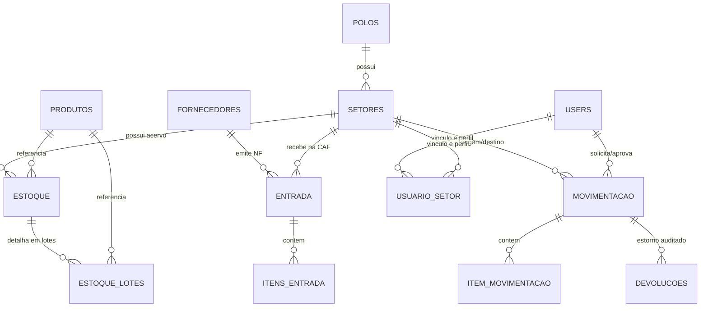

# 🗄️ Modelo de Dados e Ledger de Auditoria

O banco de dados do ProGest é estruturado sobre o motor **MySQL 8.0** com conformidade transacional ACID estrita e chaves estrangeiras com integridade referencial.

---

## 📊 Diagrama Entidade-Relacionamento Resumido

---

## 📑 Principais Tabelas do Sistema

### 1. `polos`
Registra as unidades hospitalares da rede física.
* `id` (PK)
* `nome`: Nome oficial do complexo (ex: Hospital Geral de Vitória da Conquista)
* `sigla`: Sigla identificadora (ex: `HGVC`, `HAP`, `HCS`, `UPA`)
* `status`: 'A' (Ativo) / 'I' (Inativo)

### 2. `setores`
Registra os 62 setores operacionais.
* `id` (PK)
* `polo_id` (FK -> `polos.id`)
* `nome`: Identificação do setor
* `estoque`: Boolean (`true` para as 7 Farmácias com estoque físico; `false` para setores de consumo)
* `tipo`: `Medicamento`, `Material`, `Ambos`
* `status`: 'A' / 'I'

### 3. `setor_distribuidor`
Matriz topológica de roteamento de suprimentos.
* `setor_solicitante_id` (FK -> `setores.id`)
* `setor_distribuidor_id` (FK -> `setores.id`)

### 4. `produtos`
Catálogo mestre oficial baseado no padrão **SIMPAS Bahia**.
* `id` (PK)
* `nome`: Descrição técnica padronizada
* `codigo_simpas`: Código no sistema de compras da Bahia
* `codigo_barras`: EAN-13 para leitura óptica
* `grupo_produto_id` (FK -> `grupo_produto.id`)
* `unidade_medida_id` (FK -> `unidade_medida.id`)
* `lista_portaria`: `A1`, `A2`, `B1`, `B2`, `C1` ou `null` (Portaria 344/98)
* `status`: 'A' / 'I'

### 5. `estoque` e `estoque_lotes`
Gerenciamento de saldo consolidado e rastreabilidade por lote.
* **`estoque`:**
  - `setor_id` (FK)
  - `produto_id` (FK)
  - `quantidade_atual`: Saldo físico disponível
  - `quantidade_minima`: Ponto de pedido / estoque mínimo
* **`estoque_lotes`:**
  - `setor_id`, `produto_id`
  - `lote`: Código impresso pelo fabricante
  - `quantidade_disponivel`: Saldo atual daquele lote
  - `valor_unitario`: Custo contábil de aquisição
  - `data_fabricacao`, `data_vencimento`

### 6. `movimentacao` e `item_movimentacao`
Ciclo de vida das transferências e dispensações hospitalares.
* **`movimentacao`:**
  - `setor_origem_id`, `setor_destino_id`
  - `usuario_id` (Solicitante)
  - `aprovador_usuario_id` (Almoxarife)
  - `tipo`: `T` (Transferência), `C` (Consumo interno / avaria), `D` (Devolução)
  - `status_solicitacao`:
    - `C`: Rascunho aberto (pode ser editado pelo solicitante)
    - `P`: Pendente de triagem
    - `A`: Aprovada / Concluída com dispensação
    - `R`: Reprovada com parecer técnico
    - `X`: Cancelada pelo solicitante

---

## 📜 Ledger Imutável de Auditoria (`estoque_ledger`)

Para assegurar conformidade e auditoria hospitalar, cada modificação física gera uma entrada no ledger contábil:

| Campo | Tipo | Descrição |
|---|---|---|
| `id` | BigInt (PK) | Sequencial único do evento |
| `setor_id` | Int (FK) | Setor afetado |
| `produto_id` | Int (FK) | Item movimentado |
| `lote` | Varchar | Lote físico específico |
| `tipo_operacao` | Enum | `ENTRADA_NF`, `DISPENSACAO`, `RESSUPRIMENTO`, `DEVOLUCAO`, `AJUSTE_AVARIA` |
| `quantidade` | Decimal | Variação positiva ou negativa |
| `saldo_anterior` | Decimal | Quantidade antes do evento |
| `saldo_resultante` | Decimal | Quantidade após o evento |
| `referencia_id` | Int | ID da movimentação ou da nota fiscal de entrada |
| `usuario_id` | Int (FK) | Responsável pela ação |
| `created_at` | Timestamp | Registro temporal com fuso horário auditado |
